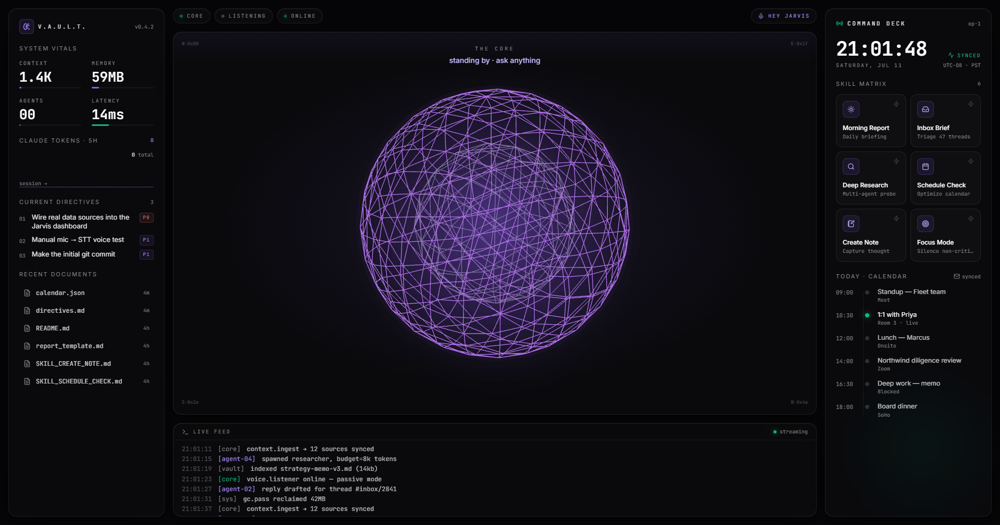

# Jarvis — Local-First Agentic OS Dashboard

A terminal-inspired graphical + vocal layer over Claude Code and local automation.
Everything runs on `localhost` except the outbound call to Anthropic (via the Claude Code CLI).



Voice in (local Whisper STT) → 3-tier intent router → headless `claude -p` skill
execution over the Obsidian vault → voice out (local Kokoro TTS), with an
audio-reactive 3D core and live system telemetry — all streamed to the UI over
WebSockets.

## Services

| Service       | Port  | Runtime            | Folder          |
|---------------|-------|--------------------|-----------------|
| Frontend UI   | 5173  | React 19 + Vite    | `frontend/`     |
| Orchestrator  | 3000  | Node.js + Express  | `orchestrator/` |
| STT Engine    | 8000  | Python + FastAPI   | `ml/stt_service.py` |
| TTS Engine    | 8001  | Python + FastAPI   | `ml/tts_service.py` |
| Data Vault    | fs    | Obsidian markdown  | `vault/Jarvis_Vault/` |

## This machine

- **No NVIDIA GPU / CUDA** (Intel Arc). ML services are configured for **CPU**
  (`faster-whisper` → `device="cpu"`, `compute_type="int8"`; Kokoro CPU ONNX).
  Flip the `JARVIS_DEVICE` env var to `cuda` if you move to an NVIDIA box.

## Quick start (after scaffold is fleshed out)

```bash
# 1. ML microservices
cd ml && python -m venv .venv && .venv\Scripts\activate && pip install -r requirements.txt
python stt_service.py   # :8000
python tts_service.py   # :8001

# 2. Orchestrator
cd orchestrator && npm install && npm run dev   # :3000

# 3. Frontend
cd frontend && npm install && npm run dev        # :5173
```

## Build order

See the master spec. Current status: **scaffold complete**, service logic stubbed.

1. [x] Repo structure + manifests for all four services
2. [x] Python FastAPI STT/TTS with hot-loaded models (round-trip verified)
3. [x] Node orchestrator: WS hub + 3-tier router (Tier 1 verified) + skill wrapper + run_skill
4. [x] Obsidian vault structure + Skill SOP files
5. [x] React shell: grid, Zustand store, glass panels (ported from Lovable)
6. [x] 3D audio-reactive core sphere (renders in-browser)
7. [x] Framer Motion + Live Terminal Feed (wired to real WS logs, mock fallback)
8. [x] End-to-end wiring:
       - Skill Matrix → orchestrator run_skill → claude -p → skill_state/terminal to UI (verified)
       - Voice out: skill completion → 🔊 summary → TTS (:8001) → audio playback (verified: POST 200)
       - Voice in: HEY JARVIS mic → MediaRecorder → STT (:8000) → router (wired; mic needs a
         manual permission grant, so not covered by headless automation)

## Running the app (dev)

- ML:            `ml/.venv/Scripts/python ml/stt_service.py` and `... tts_service.py`
- Orchestrator:  `npm --prefix orchestrator run dev`   (:3000)
- Frontend:      `npm --prefix frontend run dev`        (:5173)

Frontend UI is ported from the Lovable "Jarvis Command Center" project
(editor: lovable.dev/projects/3f18d5dc-8e90-43c6-b91b-e633695575ff).

## Live data sources (no mock)

The orchestrator broadcasts a `state_update` every 3s (and on connect). Panels bind
to it, falling back to demo values only when the socket is offline.

| Panel              | Real source                                                        |
|--------------------|--------------------------------------------------------------------|
| Vitals · CONTEXT   | total vault content size (≈ tokens = bytes/4)                      |
| Vitals · MEMORY    | orchestrator process RSS                                           |
| Vitals · AGENTS    | skills currently executing                                         |
| Vitals · LATENCY   | measured event-loop lag                                            |
| Claude Tokens      | cumulative tokens processed by skill runs this session (est.)      |
| Current Directives | `vault/99_System/directives.md`  (format: `- [P0] <title>`)       |
| Recent Documents   | most-recently-modified files in the vault                         |
| Today · Calendar   | `vault/99_System/calendar.json`  (edit to change events)          |
| Live Feed          | real `claude -p` stdout streamed over WebSocket                   |

Note: token counts are estimated from real I/O byte counts (bytes/4), not the
provider's exact usage meter. Calendar/directives are local files (no Google OAuth).
